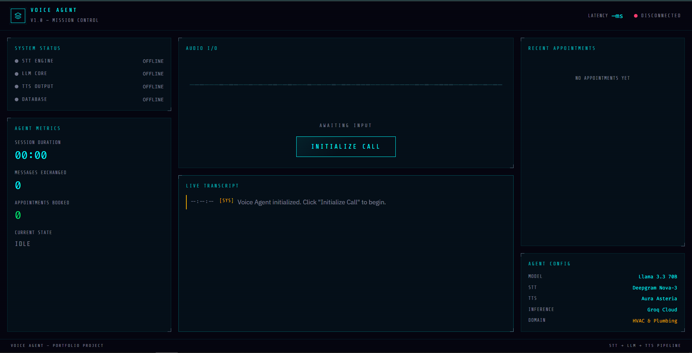

# 🎙️ AI Voice Agent — Mission Control Console



A production-ready, conversational AI Voice Agent designed to simulate an automated customer service representative for an HVAC & Plumbing company. Built to demonstrate a complete, robust system architecture (Speech-to-Text → LLM inference → Text-to-Speech) using high-performance local and free-tier components.

## ✨ Features

- **Local Speech-to-Text (STT):** Powered by **Faster-Whisper** (`tiny.en` model). Runs locally on your CPU with optimized `int8` quantization for near-instant transcription.
- **Lightning Fast LLM Inference:** Powered by **Groq (Llama 3.3 70B)**, ensuring reasoning and response generation happen in milliseconds.
- **Neural Text-to-Speech (TTS):** Uses **Microsoft Edge TTS** to generate high-quality, natural-sounding neural voices without requiring an API key.
- **Energy-Based VAD:** Custom Voice Activity Detection (VAD) on the server-side to detect speech boundaries and trigger transcription automatically.
- **AI Function Calling (Tool Use):** The LLM autonomously extracts caller details (Name, Issue, Urgency) and schedules database appointments in real-time.
- **Barge-in Support:** If the user interrupts, the system cancels the ongoing response and processes the new speech instantly.
- **Cyberpunk "Mission Control" UI:** A custom, fully responsive frontend Dashboard that visualizes live waveforms, agent text streams, active states, and real-time booked appointments.
- **Zero-Cost STT/TTS:** Architected to run entirely for free by using local models and open-source TTS streams.

## 🛠️ Architecture & Tech Stack

- **Backend:** Python + FastAPI (handling REST endpoints and high-concurrency WebSocket streaming).
- **Frontend:** Vanilla HTML, TailwindCSS, JavaScript (handling Web Audio API for capture and MP3 playback).
- **Database:** SQLite (managed via SQLAlchemy ORM).
- **AI Core:**
  - `faster-whisper` for local, high-speed STT.
  - `edge-tts` for high-quality, free neural TTS.
  - `groq` (Llama 3.3) for intelligence and tool calling.

## 📂 Project Structure

```text
.
├── app/
│   ├── static/               # Frontend assets
│   │   ├── index.html        # Main dashboard UI
│   │   ├── script.js         # Audio capture & WebSocket logic
│   │   └── style.css         # Cyberpunk styling
│   ├── agent.py              # LLM logic & tool definitions
│   ├── config.py             # Environment configuration (Groq only)
│   ├── database.py           # SQLAlchemy models & DB setup
│   ├── whisper_client.py     # Local STT & Edge TTS integration
│   ├── logger.py             # Server-side logging
│   ├── main.py               # FastAPI app initialization
│   └── websocket.py          # Real-time streaming handler
├── assets/                   # Documentation images
├── main.py                   # Application entry point
├── requirements.txt          # Python dependencies
└── .env                      # API keys (Groq only)
```

## 🚀 Getting Started

### Prerequisites

You will need Python 3.9+ and a free API key for the LLM:
- **[Groq Cloud](https://console.groq.com/keys)** (for Llama model execution)

### 1. Clone & Install Dependencies

```bash
git clone https://github.com/Abdullah-Zafarr/Customer-Support-Voice-Agent-.git
cd voice-agent-mission-control

# Create and activate a virtual environment
python -m venv .venv
# Windows:
.\.venv\Scripts\activate
# Mac/Linux:
source .venv/bin/activate

# Install requirements
pip install -r requirements.txt
```

### 2. Configure Environment Variables

Create a `.env` file in the root directory and add your Groq key:

```env
GROQ_API_KEY="your_groq_api_key_here"
```
*(No Deepgram key required anymore!)*

### 3. Run the Server

```bash
python main.py
```
*Note: The first time you speak, the system will download a small (~40MB) Whisper model automatically.*

### 4. Experience the Agent

Open your browser and navigate to:
**http://127.0.0.1:8000**

- Click **"Initialize Call"**.
- Try saying: *"Hi, my name is John and my basement is flooding!"*
- Watch the Mission Control console process the transcript, make a tool call, and book the emergency appointment on the dashboard while speaking back to you seamlessly.

## 🧠 System Pipeline Internals

1. **Capture**: Audio is captured via `MediaDevices` API, resampled to 16kHz PCM16.
2. **Stream**: Binary chunks are sent over a persistent `WebSocket` to the FastAPI server.
3. **VAD**: The server monitors audio energy. Once a "speech + silence" pattern is detected, it triggers Whisper.
4. **STT**: **Faster-Whisper** transcribes the accumulated buffer locally.
5. **LLM**: The transcript is sent to **Groq (Llama 3.3)**.
6. **Tool Use**: If the LLM invokes `book_appointment`, the server writes to SQLite and provides the result back to the LLM.
7. **TTS**: The finalized response is converted to audio via **Edge TTS**.
8. **Playback**: MP3 chunks are streamed to the browser, accumulated, and played back through the Web Audio API.

## 📄 License

This project is licensed under the MIT License. Built as a portfolio project demonstrating scalable, cost-effective AI architecture.
